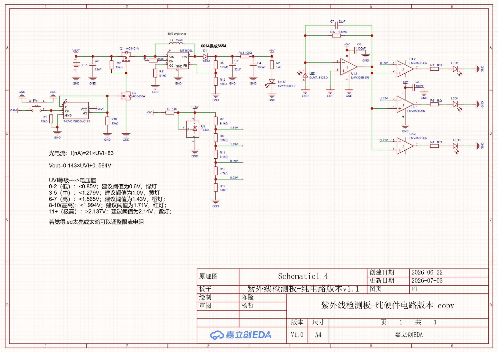
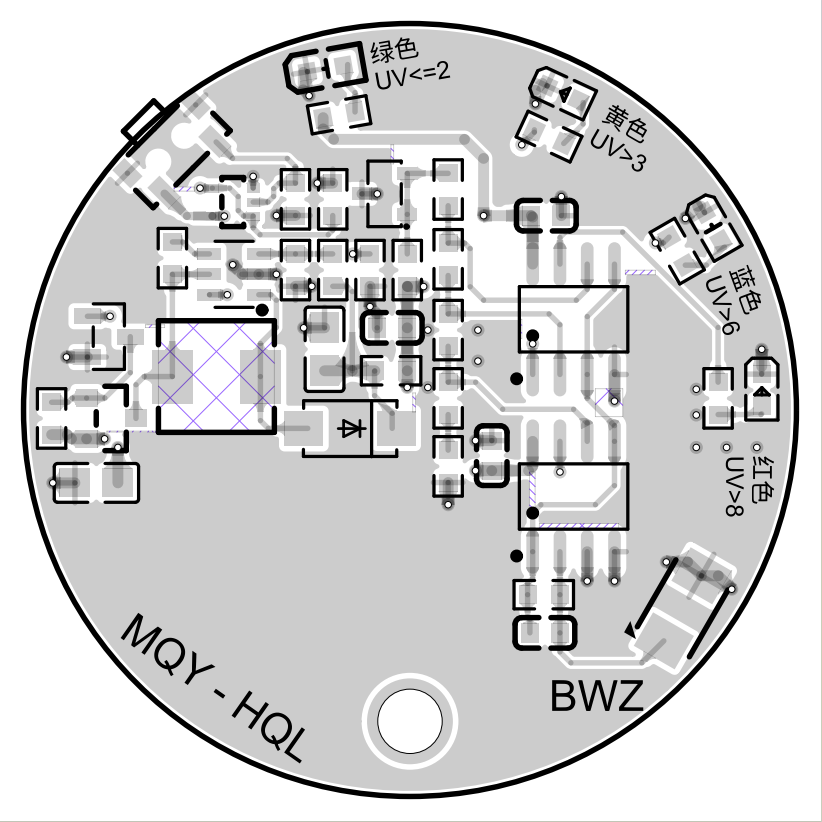
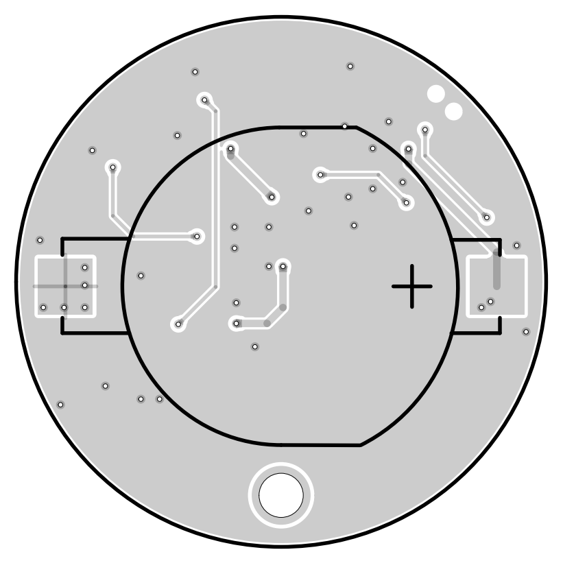
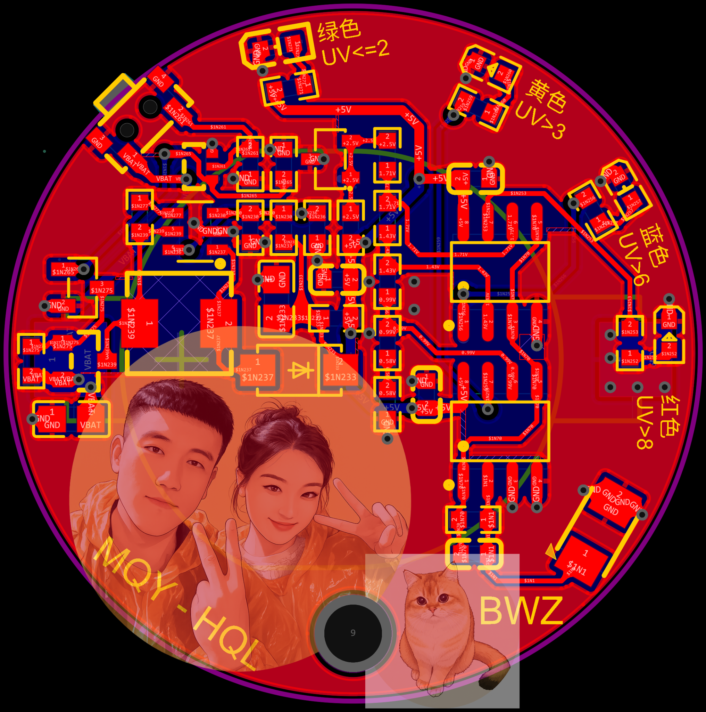

# UV Detector Board: A Pure Hardware UV Detection System

## 1. Project Introduction

```yaml
---
title: UV Detector Board
published: 2026-10-03
description: Complete engineering documentation of a compact UV detector board based on analog hardware circuits, including schematic analysis, PCB layout, and prototype design.
image: "./pcb_mau.jpg"
tags: ["PCB Design", "JLCEDA", "UV Detection"]
category: Hardware
draft: false
---
```

This project is a compact ultraviolet (UV) intensity detection board designed with a **pure hardware architecture**.

The system does not rely on:

- Microcontrollers;
- Firmware programming;
- Digital communication modules.

The complete detection process is implemented through analog electronic circuits:

```
UV Radiation
      ↓
UV Sensor
      ↓
Current-to-Voltage Conversion
      ↓
Signal Amplification
      ↓
Voltage Comparison
      ↓
LED Indicator Output
```

The circuit and PCB were designed using **JLCEDA**.

Official website:

https://lceda.cn/

---

# 2. Hardware Functions

## 2.1 UV Intensity Detection

The UV sensor converts ultraviolet radiation into an electrical signal.

According to the schematic design, the photodiode output current is related to UV intensity:

```
I(nA) = 21 × UV + 83
```

The sensor signal is converted into voltage:

```
Vout = 0.143 × UV + 0.564 V
```

This voltage is processed by the analog circuit and used for UV level classification.

---

## 2.2 UV Level Indication

The board provides multiple LED indicators.

The threshold design is:

| UV Level | Voltage Range | Indicator |
|---|---|---|
| UV 0-2 | <0.85 V | Green LED |
| UV 3-5 | <1.279 V | Yellow LED |
| UV 6-7 | <1.565 V | Blue LED |
| UV 8-10 | <1.994 V | Red LED |
| UV ≥11 | >2.137 V | High-level indication |

The user can directly identify UV intensity through LED color changes.

---

# 3. Circuit Design Analysis

## 3.1 Power Supply Circuit



The power module contains:

- Battery input;
- Power switch;
- Voltage conversion circuit;
- +5 V analog supply generation.

Main functions:

- Provide stable operating voltage;
- Reduce battery consumption;
- Improve circuit reliability.

---

## 3.2 UV Signal Acquisition Circuit

The UV sensing stage consists of:

- UV photodetection element;
- Operational amplifier;
- Feedback network.

The weak sensor current signal is converted into a stable voltage signal.

Signal processing:

```
UV Sensor Current
        ↓
Operational Amplifier
        ↓
Voltage Signal
        ↓
Comparator Input
```

---

## 3.3 Analog Amplification and Comparison

The circuit uses LMV358 operational amplifiers.

Functions:

- Signal amplification;
- Voltage buffering;
- Threshold comparison.

Different comparison thresholds correspond to different UV levels.

---

# 4. PCB Design

## 4.1 PCB Top Layout



The PCB adopts a circular structure.

Advantages:

- Compact size;
- Portable design;
- Short signal paths;
- Easy integration into wearable devices.

Functional areas:

| Region | Function |
|---|---|
| Left area | Power supply and battery circuit |
| Center area | Analog processing circuit |
| Outer area | UV indicator LEDs |
| Bottom interface | Pin header and expansion |

---

## 4.2 PCB Bottom Layer



The bottom layer mainly provides:

- Ground plane;
- Signal routing;
- Mechanical support.

The layout separates sensitive analog signals from power circuits to reduce interference.

---

# 5. Prototype Design



The final PCB design integrates:

- Circular PCB structure;
- Multiple UV indicator LEDs;
- Battery interface;
- Debug and expansion pins.

The physical prototype also includes external pin-header connections for testing and modification.

---

# 6. Engineering Platform

This project was developed with:

## JLCEDA

JLCEDA is an online EDA platform supporting:

- Schematic design;
- PCB layout;
- Component management;
- Manufacturing preparation.

Website:

https://lceda.cn/

---

# 7. Summary

This UV detector board demonstrates a complete analog hardware sensing system.

The design achieves:

**UV sensing → analog processing → threshold decision → visual feedback**

without requiring software control.

It is suitable for:

- Electronics education;
- PCB design practice;
- Sensor system development;
- Low-power portable hardware projects.

